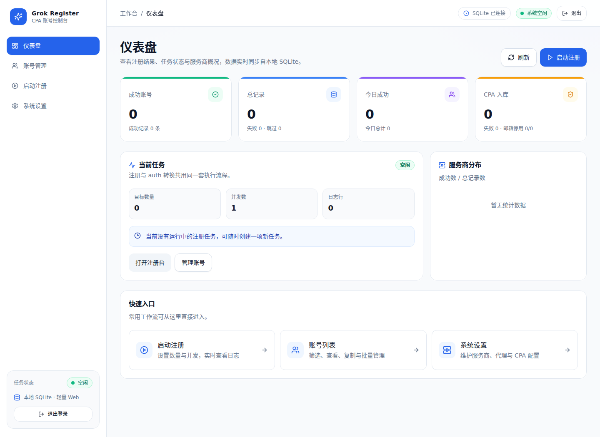
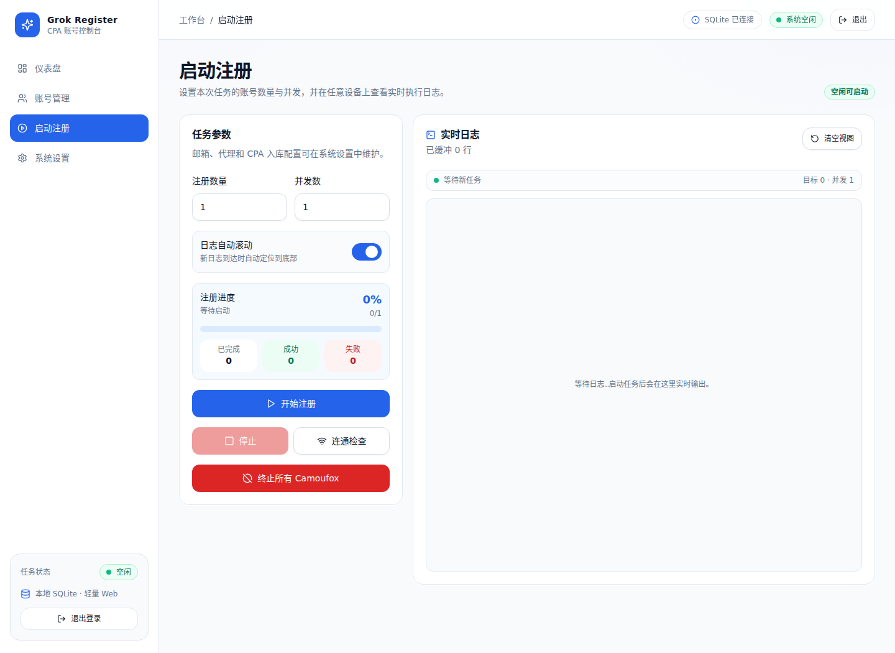
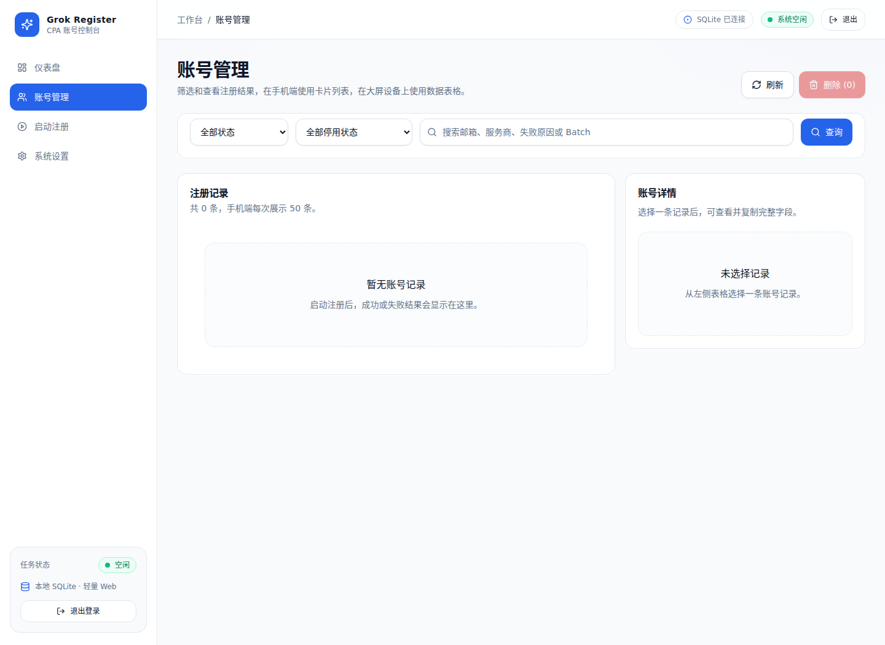

# Grok Register

基于 FastAPI、React 和 Camoufox 的 xAI / Grok 账号注册管理工具。Web 控制台驱动 Camoufox 浏览器走完
`accounts.x.ai` 注册流程，从临时邮箱取验证码，再把拿到的 `sso` 换成 CPA / Grok2API 授权文件。

[部署文档](DEPLOYMENT.md) · [Web 说明](WEB.md)

## 快速开始

一共三步：**启动服务 → 创建管理员 → 配置邮箱服务商**。第三步不做完注册一定失败，因为模板配置里的邮箱地址是占位值。

### 第 1 步 · 启动服务

两种方式选一种即可。

#### 方式 A · 本机运行（建议先用它跑通）

需要 Python 3.10+。另外建议装 Node.js 22+ 用来构建控制台页面（不装也能启动，但首页会返回 503，只有 API 可用）。
**Linux 还要装 GTK 等图形运行库**，不然浏览器起不来（详见下方常见问题「Linux 浏览器起不来」）：

```bash
sudo apt install -y libgtk-3-0 libasound2 libdbus-glib-1-2 libx11-xcb1 libxt6 libxtst6
```

```bash
git clone https://github.com/JamesZhaoY/grok-register.git
cd grok-register

scripts/start-macos.sh --open      # macOS
scripts/start-linux.sh --open      # Linux（无桌面的服务器再加 --xvfb）
```

Windows 在 PowerShell 里执行：

```powershell
powershell -ExecutionPolicy Bypass -File scripts\start-windows.ps1 -Open
```

也可以直接双击 `scripts\start-windows.bat`。

脚本按顺序自动准备 `.venv` → Python 依赖 → Camoufox 浏览器引擎 → `config.json` → 前端产物，然后拉起控制台。
**首次运行需要下载几百 MB 的浏览器引擎，慢是正常的**，之后再启动只要几秒。`git pull` 之后如果前端源码比
`front/dist` 新，脚本会自动重新构建，不用手动加 `--rebuild-web`。`Ctrl+C` 停止服务。

不确定环境是否齐全，可以先体检（只检查，不启动服务）：

```bash
scripts/start-macos.sh --check
```

#### 方式 B · Docker

宿主机只需要 Docker 和 Docker Compose，不需要 Python、Node 和桌面环境。

```bash
git clone https://github.com/JamesZhaoY/grok-register.git
cd grok-register
cp .env.example .env
docker compose up -d --build
```

容器内用 **Xvfb + 有头 Camoufox**，所以无桌面的 Linux 服务器也能跑；Docker 模式会强制关闭无头模式。
完整说明见 [DEPLOYMENT.md](DEPLOYMENT.md)。

### 第 2 步 · 打开控制台并创建管理员

```text
http://127.0.0.1:8787
```

第一次访问会进入初始化页面：填账号（至少 3 个字符）和两遍密码（至少 8 个字符）就完成了。
**整个系统只能创建一个管理员**，之后没有新增账号的入口。凭据以哈希形式保存在 `data/web_auth.json`，
忘记密码只能删掉这个文件重新初始化。

页面显示 `503 Web UI 未构建` 说明前端没编译。装好 Node.js 22+ 后重新构建：

```bash
scripts/start-macos.sh --rebuild-web     # 或 cd front && npm install && npm run build
```

### 第 3 步 · 配置邮箱服务商，然后启动注册

登录后进入 **系统设置 → 邮箱服务**。默认服务商是 Cloudflare 临时邮箱，而模板里的地址
`https://temp-mail.example.com` 只是占位符，**不改就注册不了**。

最省事的选择是 **DuckMail / Mail.tm**：用公共接口时 API Key 可以留空。各服务商需要填什么：

| 邮箱服务商 | 需要填写 |
| --- | --- |
| DuckMail / Mail.tm | 公共接口可全部留空；用 DuckMail 自有配额时填 API Key |
| Cloudflare 临时邮箱 | 自建 Worker / API 地址、鉴权方式、收信路径 |
| VMail 临时邮箱 | API Key（vmail.dev / mail.22y.uk Open API） |
| YYDS 临时邮箱 | API Key 或 JWT，可固定已验证域名 |
| MailNest 迈巢 Outlook | API Key + 项目代码 |
| CloudMail 自建邮箱 | 站点地址、管理员账号密码、域名 |
| OutlookEmail 邮箱池 | 邮箱池地址 + API Key，见 [DEPLOYMENT.md](DEPLOYMENT.md#可选-outlookemail-邮箱池) |

注册过程要能访问 x.ai。网络不通时在 **系统设置 → 基础注册** 填 `proxy`，例如 `http://127.0.0.1:7897`。

保存配置后进入 **启动注册** 页：

1. 填注册数量和并发数（上限分别是 100000 和 10）
2. 点 **连通检查** 确认代理与 x.ai 可达；被 Cloudflare 拦住时整批任务会直接终止
3. 点 **开始注册**，右侧实时日志会输出每一步

成功的账号写入 `data/accounts/`，授权 JSON 写入 `data/cpa_auth/` 和 `data/grok2api_auth/`，
在 **账号管理** 页可以筛选、查看、复制和下载。失败会记录失败类型，并在可能时保存现场截图。

## 启动脚本参数

Linux / macOS 用双横线，Windows 换成单横线（`--host` 对应 `-BindHost`）：

| 参数 | 说明 |
| --- | --- |
| `--host 0.0.0.0` | 允许局域网访问，默认只监听 `127.0.0.1` |
| `--port 9000` | 更换监听端口 |
| `--check` | 只体检环境（Python、依赖、引擎、端口、配置、前端），不启动服务 |
| `--open` | 启动后自动打开浏览器 |
| `--skip-install` | 跳过依赖安装与前端构建，直接启动 |
| `--rebuild-web` | 强制重新构建前端 |
| `--docker` | 改用 `docker compose` 部署，等价于手敲 compose 命令 |
| `--with-outlookemail` | 配合 `--docker`，同时启动可选 OutlookEmail 邮箱池 |
| `--xvfb` | 仅 Linux：无桌面服务器时套 Xvfb 跑有头 Camoufox |

## 界面预览

### 仪表盘



### 注册台与账号管理

| 启动注册 | 账号管理 |
| --- | --- |
|  |  |

## 功能

- Web 控制台：任务进度、实时日志、账号管理和系统设置
- Camoufox 浏览器，支持多 worker 和异常进程清理
- 支持 Cloudflare、DuckMail / Mail.tm、YYDS、MailNest、OutlookEmail、CloudMail、VMail（mail.22y.uk）
- 注册完成后生成 CPA / Grok2API JSON，支持查看、复制、下载和自动导入远程站点
- 首次访问创建唯一管理员账号
- Docker Compose 部署，支持无桌面 Linux 服务器
- Linux / macOS / Windows 一键启动脚本，自动准备虚拟环境、依赖、浏览器引擎和前端产物

## Docker 部署

查看状态和日志：

```bash
docker compose ps
docker compose logs -f grok-register
curl http://127.0.0.1:8787/api/health
```

停止和更新：

```bash
docker compose down
git pull && docker compose up -d --build
```

如果配置里的代理是 `127.0.0.1:7897`，Compose 会自动映射到宿主机代理。宿主机代理软件需要允许局域网连接
（监听 `0.0.0.0` 或 Docker 网桥地址）。

### 可选 OutlookEmail 邮箱池

Compose 已集成 [`ghcr.io/assast/outlookemail:latest`](https://github.com/assast/outlookEmail)，默认不随主服务启动。
需要选择 OutlookEmail 邮箱、导入账号或读取邮件时，在 `.env` 修改登录密码和 `SECRET_KEY`，然后启动可选 profile：

```bash
docker compose --profile outlookemail up -d
```

访问地址：

```text
Grok Register: http://服务器IP:8787
OutlookEmail:  http://服务器IP:5000
```

主容器内的 API Base 使用内部服务名 `http://outlook-email:5000`（Docker 首次生成 `data/config.json` 时会预填），
已有配置可在“系统设置 → Outlook 邮箱池”中填写。数据保存在 `outlookemail-data/`，已被 Git 和 Docker 构建上下文忽略。
完整配置见 [DEPLOYMENT.md](DEPLOYMENT.md#可选-outlookemail-邮箱池)。

## 配置文件

| 运行方式 | 读取路径 |
| --- | --- |
| 本机运行 | 项目根目录 `config.json` |
| Docker | 宿主机 `data/config.json` |

两种方式的配置文件都由 `scripts/seed_config.py` 按 [`config.example.json`](config.example.json) 生成：
缺失时创建，已存在时只补齐模板里的新增键、不覆盖已填写的值。所以**平时直接在 Web 的“系统设置”里改就行**。

把现有本地配置搬到 Docker：

```bash
mkdir -p data
cp config.json data/config.json
docker compose restart grok-register
```

Docker 配置中的授权目录建议保持指向挂载卷：

```json
{
  "cpa_auth_dir": "data/cpa_auth",
  "grok2api_auth_dir": "data/grok2api_auth"
}
```

## 主要配置

建议直接在 Web 设置页填写。

| 配置项 | 说明 |
| --- | --- |
| `email_provider` | 邮箱服务商 |
| `register_count` | 注册数量，默认 1，上限 100000 |
| `register_workers` | 并发数量，默认 1，上限 10 |
| `proxy` | 注册和 OAuth 请求使用的代理 |
| `browser_headless` | 本机无头模式；Docker 中强制关闭 |
| `cpa_auto_add` | 注册后生成 CPA 授权 |
| `cpa_auth_dir` | CPA JSON 保存目录 |
| `cpa_remote_url` | CPA Management API 地址 |
| `cpa_management_key` | CPA 管理密钥 |
| `grok2api_auth_dir` | Grok2API JSON 保存目录 |
| `grok2api_remote_url` | 远程 Grok2API 站点根地址 |
| `grok2api_remote_username` | 远程 Grok2API 管理员账号 |
| `grok2api_remote_password` | 远程 Grok2API 管理员密码 |
| `grok2api_auto_import` | JSON 生成后自动登录并导入远程 Grok2API |

## 数据目录

```text
data/
├── config.json                   # Docker 配置
├── web_auth.json                 # Web 管理员认证
├── accounts/                     # 账号和注册结果（含 SQLite 结果库）
├── cpa_auth/                     # CPA JSON
├── grok2api_auth/                # Grok2API JSON
└── screenshots/                  # 注册失败现场截图

logs/                             # 运行日志
outlookemail-data/                # 可选 OutlookEmail 数据
```

`data/`（除说明文件）、`logs/`、本地 `config.json` 和 `.env` 都已被 Git 忽略，里面是实时凭据，不要提交。

## 常用命令

```bash
# 体检本机环境（不启动服务）
scripts/start-macos.sh --check

# 后端测试
.venv/bin/python -m unittest discover -s backend/tests -v

# 前端构建
cd front && npm run build

# 验证容器内的有头 Camoufox
docker compose run --rm grok-register python /app/docker/camoufox_smoke.py
```

## 常见问题

### 打开首页是 503 「Web UI 未构建」

前端没编译。装好 Node.js 22+ 后执行 `scripts/start-macos.sh --rebuild-web`，
或手动 `cd front && npm install && npm run build`。API（含 `/api/docs`）在未构建时仍可用。

### 创建管理员后立刻 401，被弹回登录页

会话 Cookie 没被浏览器保存。`GROK_WEB_COOKIE_SECURE` 默认是 `auto`：只有请求本身是 HTTPS
（含反代转发的 `X-Forwarded-Proto: https`）才给 Cookie 加 `Secure` 标记，纯 HTTP 访问不加，
所以用局域网 IP 打开也能正常登录。**如果你的版本较旧，先 `git pull` 更新**，旧版默认恒开 `Secure`，
浏览器在纯 HTTP 页面下会直接丢弃 Cookie。

想手动固定这个行为：

```bash
GROK_WEB_COOKIE_SECURE=0 scripts/start-macos.sh --host 0.0.0.0   # 恒关，纯 HTTP 部署
GROK_WEB_COOKIE_SECURE=1 scripts/start-macos.sh                  # 恒开，仅 HTTPS 部署
```

Docker 改 `.env` 里的同名变量，再 `docker compose up -d --force-recreate`。
另外浏览器若开了「阻止所有 Cookie」，任何设置都救不回来，需要给该站点放行。

### 忘记管理员密码

删除 `data/web_auth.json` 后重新访问，会再次进入初始化页面。该文件是唯一凭据来源，删除前请确认。

### 端口被占用

启动脚本会直接拒绝启动。换端口：`scripts/start-macos.sh --port 9000`；
Docker 改 `.env` 里的 `GROK_WEB_PORT` 再 `docker compose up -d --force-recreate`。

### Camoufox 没装好

```bash
.venv/bin/python -m camoufox fetch
.venv/bin/python -m camoufox version
```

macOS 首次启动浏览器会被 Gatekeeper 拦一次，在「系统设置 → 隐私与安全性」里放行即可。

### Linux 浏览器起不来

日志里出现下面任意一行，都是**宿主机缺系统库**，不是 Camoufox 没下载好：

```text
libgtk-3.so.0: cannot open shared object file: No such file or directory
XPCOMGlueLoad error for file .../libmozgtk.so
Couldn't load XPCOM.
```

Camoufox 是 Firefox 分支，`camoufox fetch` 只下引擎，GTK 这些图形库得由系统提供。装依赖：

```bash
sudo .venv/bin/python -m playwright install-deps firefox            # Debian/Ubuntu，推荐
sudo apt install -y libgtk-3-0 libasound2 libdbus-glib-1-2 \
     libx11-xcb1 libxt6 libxtst6 libnss3                            # 手动装也行
sudo dnf install -y gtk3 alsa-lib dbus-glib libXt libXtst nss       # RHEL/Fedora
sudo pacman -S --needed gtk3 alsa-lib dbus-glib libxt libxtst nss   # Arch
```

装完不用重新 fetch 引擎，直接重新点「开始注册」。`scripts/start-linux.sh --check` 会用 `ldd`
扫引擎目录，提前把缺的库名列出来。同一行日志里的
`Sandbox: CanCreateUserNamespace() unshare(CLONE_NEWPID): EPERM` 只是伴随告警，不是失败原因。

装不上系统库（比如受限的共享主机）就改用 Docker 部署，镜像自带全部依赖。

库装齐后如果改报显示器相关的错，说明配置里关了无头模式而服务器没有桌面：用
`scripts/start-linux.sh --xvfb` 启动，或在「系统设置 → 基础注册」打开无头浏览器。

### Docker 构建报 the --mount option requires BuildKit

宿主机没装 buildx 插件，`docker compose build` 退回了旧版构建器。镜像已经改成旧语法可构建，
`git pull` 后重跑 `docker compose up -d --build` 即可；`export DOCKER_BUILDKIT=1` 对 compose 无效。
详见 [DEPLOYMENT.md](DEPLOYMENT.md#构建报-the---mount-option-requires-buildkit)。

### Docker 改了配置没生效

Docker 读的是 `data/config.json`，不是根目录的 `config.json`。改完执行：

```bash
docker compose restart grok-register
```

### 注册一直失败 / CPA 没有出现新账号

先在注册页点 **连通检查**。再检查邮箱服务商配置是否填全、`proxy` 是否可用；
CPA 相关看 `cpa_auto_add`、`cpa_auth_dir`，或远程配置 `cpa_remote_url`、`cpa_management_key`，
并在日志里搜 `[CPA]`。注意 CPA / Grok2API 入库失败的账号会被记成失败，不计入成功数。

## 手动启动（不用脚本）

```bash
python3 -m venv .venv
.venv/bin/pip install -r requirements.txt
.venv/bin/python -m camoufox fetch

cd front && npm install && npm run build && cd ..
cp config.example.json config.json

.venv/bin/python -m backend.web.cli --host 127.0.0.1 --port 8787
```

Windows：

```powershell
.venv\Scripts\python.exe -m backend.web.cli --host 127.0.0.1 --port 8787
```

## 项目结构

```text
front/                  React 前端
backend/                Python 后端
  web/                  FastAPI、认证与任务调度
  registration/         注册编排、仓储和结果产物
  automation/           Camoufox 浏览器运行时
  integrations/         代理、连通性和授权交换
  mailbox/              邮箱渠道适配
  shared/               公共路径等基础设施
backend/tests/          后端测试
scripts/                一键启动脚本与共用配置生成
docker/                 容器启动与浏览器验证
docs/images/            Web 界面截图
compose.yaml            Docker Compose 配置
```

## 友情链接

- [Linux.do 社区](https://linux.do)

## License

[MIT](LICENSE)


